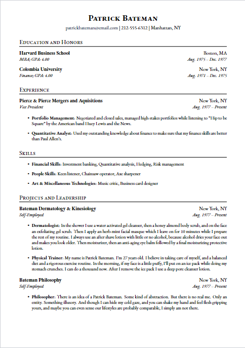

# The Patrick Bateman Resume Template: A killer (haha) resume template

    

## About
Calling all American Psycho fans! Here is an easy-to-use resume template which mimics the style characteristics of Patrick Bateman's business card, while still following the format of most resume-parsing machines to get your resume past the screening stage. Maybe you can become the next great investment banking vice president.

### Requirements
- Download the code. 
- Set `texStudio` to compile with `XeLaTeX`. 
- Then use Overleaf or another Tex compiler to compile the source code.

### Usage
- In the `main.tex` use the space between the `\begin{document}` and `\end{document}` to piece together components, as well as alter spacing between the components using `\vspace{}`.
- To change the components, check out the `Components` folder and alter the `.tex` files there. 
- To alter the dimensions of the file, check line 3 of the `main.tex` file where the dimensions are set: `\usepackage[a4paper, total={7in, 10.5in}, top=0.5in]{geometry}`.

## Contributing
Contributors are welcome! Please fork the repository and create a pull request. 

## License
Distributed under the MIT License. See `LICENSE.md` for more information.

## Contact
[Link to Author](https://github.com/divamkumar)
